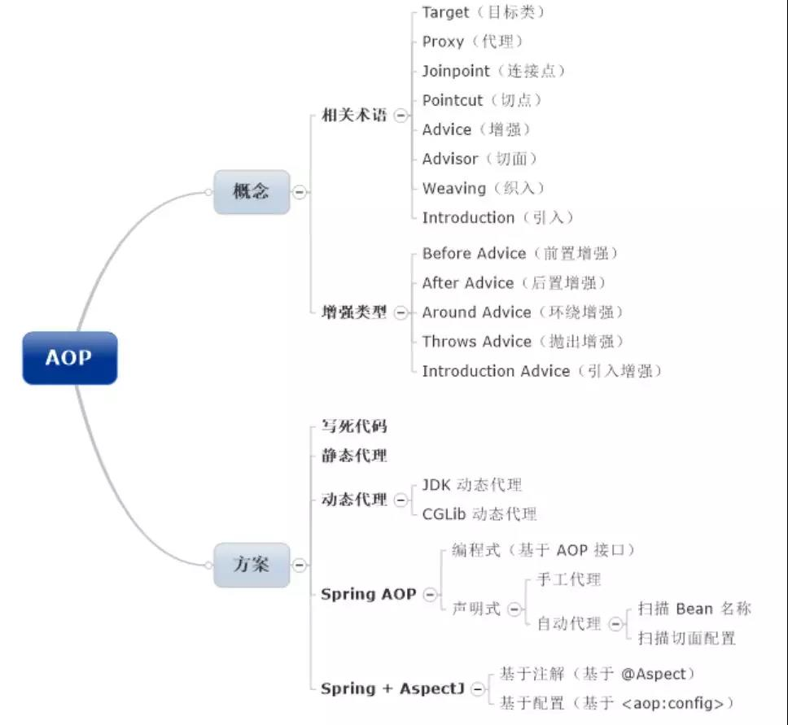
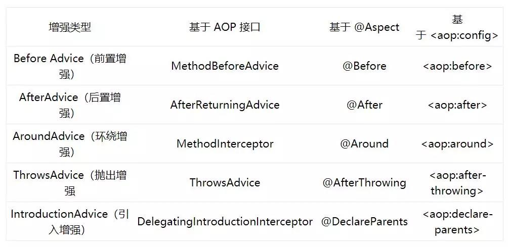

# Spring AOP

## 1.概念

​	Spring Aop 框架包括了Spring内部Aop和Spring+AspectJ 两种。

 	SpringAop的使用方式分为编程式和配置文件式。

​	先来两个例子看SpringAop的使用：

~~~ java
public interface Greeting {
	void sayHello(String name);
}
public class GreetingImpl implements Greeting {
   @Override
   public void sayHello(String name) {
       before();
       System.out.println("Hello! " + name);
       after();
   }
   private void before() {
       System.out.println("Before");
   }
   private void after() {
       System.out.println("After");
   }
}	
~~~

当我们在使用Greeting的sayHello方法时，如果想在它之前和之后做一定的事情，我们需要按照GreetingImpl中的样子，在类中新增before和after方法，来处理之前和之后的操作。但这种方式很明显硬编码，当出现了多个Greeting的实现类后，我们需要对所有的实现类进行before和after的处理。

**改进** 第一种方式不可取，那我们就通过动态代理的方式来处理这种情况。

~~~ java
public class JDKDynamicProxy implements InvocationHandler {
    private Object target;
    public JDKDynamicProxy(Object target) {
        this.target = target;
    }
    @SuppressWarnings("unchecked")
    public <T> T getProxy() {
        return (T) Proxy.newProxyInstance(
            target.getClass().getClassLoader(),
            target.getClass().getInterfaces(),
            this
        );
    }
    @Override
    public Object invoke(Object proxy, Method method, Object[] args) throws Throwable {
        before();
        Object result = method.invoke(target, args);
        after();
        return result;
    }
    private void before() {
        System.out.println("Before");
    }
    private void after() {
        System.out.println("After");
    }
}
public class Client {
    public static void main(String[] args) {
        Greeting greeting = new JDKDynamicProxy(new GreetingImpl()).getProxy();
        greeting.sayHello("Jack");
    }
}
~~~

 我们使用JDK动态代理来处理。由动态代理来处理before和after的方法。实现类内部就不需要去关心这种额外操作。JDK动态代理也采用了单例模式。这种方式，当外部在调用的时候，只需要通过代理，便可以访问到具体方法。

同样，如果代理的不是一个接口，而是一个具体的类，便不可以用JDK动态代理实现，我们可以通过CGLib动态代理处理。

​	我们在刚才方法中使用的before,after方法，在AOP中称为：Before Advice(前置增强) ,After Advice(后置增强)。前置增强和后置增强合到一起，就是Around Advice(环绕增强)

Spring使用自带的Aop实现例子为：

~~~ java
public class GreetingBeforeAdvice implements MethodBeforeAdvice {
    @Override
    public void before(Method method, Object[] args, Object target) throws Throwable {
        System.out.println("Before");
    }
}
public class GreetingAfterAdvice implements AfterReturningAdvice {
    @Override
    public void afterReturning(Object result, Method method, Object[] args, Object target) throws Throwable {
        System.out.println("After");
    }
}
public class Client {
    public static void main(String[] args) {
        ProxyFactory proxyFactory = new ProxyFactory();     // 创建代理工厂
        proxyFactory.setTarget(new GreetingImpl());         // 射入目标类对象
        proxyFactory.addAdvice(new GreetingBeforeAdvice()); // 添加前置增强
        proxyFactory.addAdvice(new GreetingAfterAdvice());  // 添加后置增强 
        Greeting greeting = (Greeting) proxyFactory.getProxy(); // 从代理工厂中获取代理
        greeting.sayHello("Jack");                              // 调用代理的方法
    }
}
~~~


XML 方式定义

~~~ xml
<?xml version="1.0" encoding="UTF-8"?>
<beans xmlns="http://www.springframework.org/schema/beans"
       xmlns:xsi="http://www.w3.org/2001/XMLSchema-instance"
       xmlns:context="http://www.springframework.org/schema/context"
       xsi:schemaLocation="http://www.springframework.org/schema/beans
 
http://www.springframework.org/schema/beans/spring-beans.xsd
http://www.springframework.org/schema/context
http://www.springframework.org/schema/context/spring-context.xsd">
 
    <!-- 扫描指定包（将 @Component 注解的类自动定义为 Spring Bean） -->
    <context:component-scan base-package="aop.demo"/>
 
    <!-- 配置一个代理 -->
    <bean id="greetingProxy" class="org.springframework.aop.framework.ProxyFactoryBean">
        <property name="interfaces" value="aop.Greeting"/> <!-- 需要代理的接口 -->
        <property name="target" ref="greetingImpl"/>       <!-- 接口实现类 -->
        <property name="interceptorNames">                 <!-- 拦截器名称（也就是增强类名称，Spring Bean 的 id） -->
            <list>
                <value>greetingAroundAdvice</value>
            </list>
        </property>
    </bean>
</beans>
~~~

客户端实现：

~~~ java
public class Client {
    public static void main(String[] args) {
        ApplicationContext context = new ClassPathXmlApplicationContext("aop/demo/spring.xml"); // 获取 Spring Context
        Greeting greeting = (Greeting) context.getBean("greetingProxy");                        // 从 Context 中根据 id 获取 Bean 对象（其实就是一个代理）
        greeting.sayHello("Jack");                                                              // 调用代理的方法
    }
}
~~~

Spring +AspectJ 方式

​	之前谈到的 AOP 框架其实可以将它理解为一个拦截器框架，但这个拦截器似乎非常武断。比如说，如果它拦截了一个类，那么它就拦截了这个类中所有的方法。类似地，当我们在使用动态代理的时候，其实也遇到了这个问题。需要在代码中对所拦截的方法名加以判断，才能过滤出我们需要拦截的方法，想想这种做法确实不太优雅。在大量的真实项目中，似乎我们只需要拦截特定的方法就行了，没必要拦截所有的方法。于是，老罗同志借助了 AOP 的一个很重要的工具，Advisor（切面），来解决这个问题。它也是 AOP 中的核心！是我们关注的重点！

也就是说，我们可以通过切面，将增强类与拦截匹配条件组合在一起，然后将这个切面配置到 ProxyFactory 中，从而生成代理。

这里提到这个“拦截匹配条件”在 AOP 中就叫做 Pointcut（切点），其实说白了就是一个基于表达式的拦截条件罢了。

归纳一下，Advisor（切面）封装了 Advice（增强）与 Pointcut（切点 ）。 

​	编程式

 ~~~ java
@Aspect					//表明该类是一个Aspect,也就是一个Advisor
@Component
public class GreetingAspect {
    @Around("execution(* aop.demo.GreetingImpl.*(..))")
    //该类无需实现特殊接口，只需要在方法中定义@Around注解，在注解中使用execution,Aspect切点表达式。方法的参数中有个对象 ProceedingJoinPoint，它在AOP中称为JoinPoint连接点。可以通过该对象获取方法的任何信息。
    public Object around(ProceedingJoinPoint pjp) throws Throwable {
        before();
        Object result = pjp.proceed();
        after();
        return result;
    }
    private void before() {
        System.out.println("Before");
    }
    private void after() {
        System.out.println("After");
    }
}

 ~~~

切点表达式：execution(* aop.demo.GreetingImpl.*(..))

- execution()：表示拦截方法，括号中可定义需要匹配的规则。

- 第一个“*”：表示方法的返回值是任意的。

- 第二个“*”：表示匹配该类中所有的方法。

- (..)：表示方法的参数是任意的。

  xml也只需两行配置即可：

~~~ xml
 <context:component-scan base-package="aop.demo"/>
    <aop:aspectj-autoproxy proxy-target-class="true"/>
~~~

​	配置式：

~~~ xml
<?xml version="1.0" encoding="UTF-8"?>
<beans ...">
    <bean id="greetingImpl" class="aop.demo.GreetingImpl"/>
    <bean id="greetingAspect" class="aop.demo.GreetingAspect"/>
    <aop:config>
        <aop:aspect ref="greetingAspect">
            <aop:around method="around" pointcut="execution(* aop.demo.GreetingImpl.*(..))"/>
        </aop:aspect>
    </aop:config>
 
</beans>
~~~

​	使用 `aop:config`元素来进行 AOP 配置，在其子元素中配置切面，包括增强类型、目标方法、切点等信息。






客户端实现：	

~~~ java
public class Client {
 
    public static void main(String[] args) {
        ApplicationContext context = new ClassPathXmlApplicationContext("aop/demo/spring.xml");
        Greeting greeting = (Greeting) context.getBean("greetingImpl");
        greeting.sayHello("Jack");
    }
}
~~~

​	


-----------------------------------------------------------------------------------------------------------------------------

## 源码分析

​	以上面最简单的一个demo来看AOP的加载过程以及处理过程。

首先，我们看源码，首先找到AOP的入口点。有很多朋友不愿意去看AOP源码的一个很大原因是因为找不到AOP源码实现的入口在哪里，这个确实是。不过我们可以看一下上面的测试代码，就普通Bean也好、AOP也好，最终都是通过getBean方法获取到Bean并调用方法的，getBean之后的对象已经前后都打印了TimeHandler类printTime()方法里面的内容，可以想见它们已经是被Spring容器处理过了。

既然如此，那无非就两个地方处理：

1. **加载Bean定义的时候应该有过特殊的处理**
2. **getBean的时候应该有过特殊的处理**

我们首先来看第一个，加载Bean定义的时候Spring做过特殊处理。

直接看代码：DefaultBeanDefinitionDocumentReader的`parseBeanDefinitions()`方法

~~~ java
protected void parseBeanDefinitions(Element root, BeanDefinitionParserDelegate delegate) {
		if (delegate.isDefaultNamespace(root)) {
			NodeList nl = root.getChildNodes();
			for (int i = 0; i < nl.getLength(); i++) {
				Node node = nl.item(i);
				if (node instanceof Element) {
					Element ele = (Element) node;
					if (delegate.isDefaultNamespace(ele)) {
						parseDefaultElement(ele, delegate);
					}
					else {
						delegate.parseCustomElement(ele);
					}
				}
			}
		}
		else {
			delegate.parseCustomElement(root);
		}
	}
~~~


当正常代码执行过程中，我们获取到的每一个<Bean id=***> 都会执行**parseDefaultElement(ele, delegate);**因为Bean标签是默认的NameSpace，但是如果遇到了<aop:config>，标签就不一样，aop:config 并不是默认的Namespace，因此，会执行，**delegate.parseCustomElement(ele);**

~~~ java
public BeanDefinition parseCustomElement(Element ele, BeanDefinition containingBd) {
		String namespaceUri = getNamespaceURI(ele);
		NamespaceHandler handler = this.readerContext.getNamespaceHandlerResolver().resolve(namespaceUri);
		if (handler == null) {
			error("Unable to locate Spring NamespaceHandler for XML schema namespace [" + namespaceUri + "]", ele);
			return null;
		}
		return handler.parse(ele, new ParserContext(this.readerContext, this, containingBd));
	}
~~~

​	当aop:config元素来到这里，首先获取NamespaceURI,**http://www.springframework.org/schema/aop**		

​	第3行的代码根据这个Namespace获取对应的NamespaceHandler即Namespace处理器，具体到aop这个Namespace的NamespaceHandler是**org.springframework.aop.config.AopNamespaceHandler**类，也就是第3行代码获取到的结果。具体到AopNamespaceHandler里面，有几个Parser，是用于具体标签转换的。当AopNamespaceHandler初始化时，会初始化这几个标签类：

```java
public void init() {
    this.registerBeanDefinitionParser("config", new ConfigBeanDefinitionParser());
    this.registerBeanDefinitionParser("aspectj-autoproxy", new AspectJAutoProxyBeanDefinitionParser());
    this.registerBeanDefinitionDecorator("scoped-proxy", new ScopedProxyBeanDefinitionDecorator());
    this.registerBeanDefinitionParser("spring-configured", new SpringConfiguredBeanDefinitionParser());
}
```

接着，就是第8行的代码，利用AopNamespaceHandler的parse方法，解析<aop:config>下的内容了。

由于标签为aop:config,所以获取到的parser为`ConfigBeanDefinitionParser`,

~~~ java
public BeanDefinition parse(Element element, ParserContext parserContext) {
		CompositeComponentDefinition compositeDef =
				new CompositeComponentDefinition(element.getTagName(), 	parserContext.extractSource(element));
		parserContext.pushContainingComponent(compositeDef);

		configureAutoProxyCreator(parserContext, element);

		List<Element> childElts = DomUtils.getChildElements(element);
		for (Element elt: childElts) {
			String localName = parserContext.getDelegate().getLocalName(elt);
			if (POINTCUT.equals(localName)) {
				parsePointcut(elt, parserContext);
			}
			else if (ADVISOR.equals(localName)) {
				parseAdvisor(elt, parserContext);
			}
			else if (ASPECT.equals(localName)) {
				parseAspect(elt, parserContext);
			}
		}

		parserContext.popAndRegisterContainingComponent();
		return null;
	}
~~~

​	重点先提一下第6行的代码，该行代码的具体实现不跟了但它非常重要，configureAutoProxyCreator方法的作用我用几句话说一下：

- 向Spring容器注册了一个BeanName为**org.springframework.aop.config.internalAutoProxyCreator**的Bean定义，可以自定义也可以使用Spring提供的（根据优先级来）

- Spring默认提供的是**org.springframework.aop.aspectj.autoproxy.AspectJAwareAdvisorAutoProxyCreator**，这个类是AOP的核心类.

- 在这个方法里面也会根据配置proxy-target-class和expose-proxy，设置是否使用CGLIB进行代理以及是否暴露最终的代理。

  ​	<aop:config> 下面的节点为<aop:aspect>  则调用parseAspect方法

  ~~~ java
  private void parseAspect(Element aspectElement, ParserContext parserContext) {
  		//获取id 和ref 信息
      	String aspectId = aspectElement.getAttribute(ID);
  		String aspectName = aspectElement.getAttribute(REF);
  
  		try {
  			this.parseState.push(new AspectEntry(aspectId, aspectName));
  			List<BeanDefinition> beanDefinitions = new ArrayList<BeanDefinition>();
  			List<BeanReference> beanReferences = new ArrayList<BeanReference>();
  
  			List<Element> declareParents = DomUtils.getChildElementsByTagName(aspectElement, DECLARE_PARENTS);
  			for (int i = METHOD_INDEX; i < declareParents.size(); i++) {
  				Element declareParentsElement = declareParents.get(i);
  				beanDefinitions.add(parseDeclareParents(declareParentsElement, parserContext));
  			}
  
  			// We have to parse "advice" and all the advice kinds in one loop, to get the
  			// ordering semantics right.
  			NodeList nodeList = aspectElement.getChildNodes();
  			boolean adviceFoundAlready = false;
  			for (int i = 0; i < nodeList.getLength(); i++) {
  				Node node = nodeList.item(i);
  				if (isAdviceNode(node, parserContext)) {
  					if (!adviceFoundAlready) {
  						adviceFoundAlready = true;
  						if (!StringUtils.hasText(aspectName)) {
  							parserContext.getReaderContext().error(
  									"<aspect> tag needs aspect bean reference via 'ref' attribute when declaring advices.",
  									aspectElement, this.parseState.snapshot());
  							return;
  						}
  						beanReferences.add(new RuntimeBeanReference(aspectName));
  					}
  					AbstractBeanDefinition advisorDefinition = parseAdvice(
  							aspectName, i, aspectElement, (Element) node, parserContext, beanDefinitions, beanReferences);
  					beanDefinitions.add(advisorDefinition);
  				}
  			}
  
  			AspectComponentDefinition aspectComponentDefinition = createAspectComponentDefinition(
  					aspectElement, aspectId, beanDefinitions, beanReferences, parserContext);
  			parserContext.pushContainingComponent(aspectComponentDefinition);
  
  			List<Element> pointcuts = DomUtils.getChildElementsByTagName(aspectElement, POINTCUT);
  			for (Element pointcutElement : pointcuts) {
  				parsePointcut(pointcutElement, parserContext);
  			}
  
  			parserContext.popAndRegisterContainingComponent();
  		}
  		finally {
  			this.parseState.pop();
  		}
  	}
  ~~~


