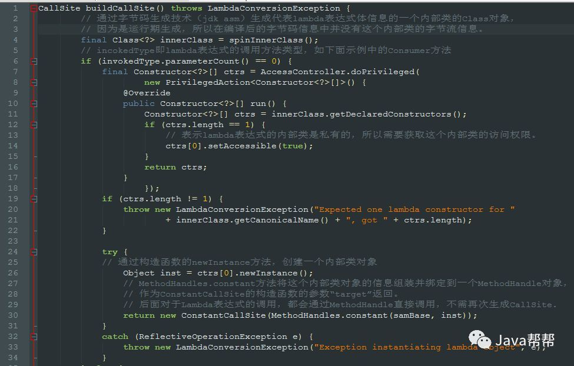
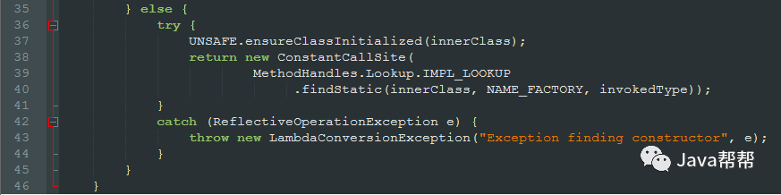
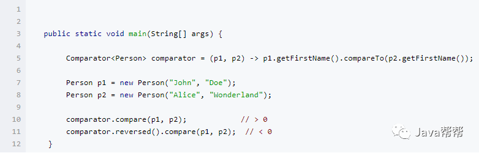

# java8新增特性

## 1.lambda

~~~java
// 1. 不需要参数,返回值为 5  
() -> 5  
  
// 2. 接收一个参数(数字类型),返回其2倍的值  
x -> 2 * x  
  
// 3. 接受2个参数(数字),并返回他们的差值  
(x, y) -> x – y  
  
// 4. 接收2个int型整数,返回他们的和  
(int x, int y) -> x + y  
  
// 5. 接受一个 string 对象,并在控制台打印,不返回任何值(看起来像是返回void)  
(String s) -> System.out.print(s)
~~~

Lambda表达式的本质只是一个"[**语法糖**](http://zh.wikipedia.org/wiki/%E8%AF%AD%E6%B3%95%E7%B3%96)",由编译器推断并帮你转换包装为常规的代码,因此你可以使用更少的代码来实现同样的功能。

我们通过一个例子来看一下，这个Lambda到底是在系统中怎么执行的。先写简单代码：

~~~java
import java.util.ArrayList;
import java.util.List;
class aa {
      void test() {
        List<String> list = new ArrayList<>();
        list.add("123");
        list.add("234");
        list.forEach((x)-> {System.out.println(x);});
    }

}
~~~

通过javac 反编译后，然后通过javap 在控制台看输出的内容

~~~java
Compiled from "new.java"
class aa {
  aa();
    Code:
       0: aload_0
       1: invokespecial #1                  // Method java/lang/Object."<init>":()V
       4: return
  void test();
    Code:
       0: new           #2                  // class java/util/ArrayList
       3: dup
       4: invokespecial #3                  // Method java/util/ArrayList."<init>":()V
       7: astore_1
       8: aload_1
       9: ldc           #4                  // String 123
      11: invokeinterface #5,  2            // InterfaceMethod java/util/List.add:(Ljava/lang/Object;)Z
      16: pop
      17: aload_1
      18: ldc           #6                  // String 234
      20: invokeinterface #5,  2            // InterfaceMethod java/util/List.add:(Ljava/lang/Object;)Z
      25: pop
      26: aload_1
      27: invokedynamic #7,  0              // InvokeDynamic #0:accept:()Ljava/util/function/Consumer;
      32: invokeinterface #8,  2            // InterfaceMethod java/util/List.forEach:(Ljava/util/function/Consumer;)V
      37: return
}
~~~

​	lambda的语法糖在编译后的字节流Class文件中，会通过invokedynamic指令指向一个bootstrap方法（下文中部分会称作“引导方法”），这个方法就是java.lang.invoke.LambdaMetafactory中的一个静态方法。通过debug的方式，就可以看到该方法的执行，此方法源码如下：

~~~java
 public static CallSite metafactory(final MethodHandles.Lookup lookup, final String s, 							final MethodType methodType,
                         final MethodType methodType2,
                         final MethodHandle methodHandle, 
                         final MethodType methodType3) 
     									throws LambdaConversionException {
  final InnerClassLambdaMetafactory innerClassLambdaMetafactory = new 													InnerClassLambdaMetafactory(
                                            lookup, 
                                            methodType,
                                            s, 
                                            methodType2, 
                                            methodHandle, 
                                            methodType3, 
                                            false, 
                                            LambdaMetafactory.EMPTY_CLASS_ARRAY,
                                            LambdaMetafactory.EMPTY_MT_ARRAY);
        innerClassLambdaMetafactory.validateMetafactoryArgs();
        return innerClassLambdaMetafactory.buildCallSite();
    }
~~~

​	在运行时期，虚拟机会通过调用这个方法来返回一个CallSite（调用点）对象。简述一下方法的执行过程，首先，初始化一个InnerClassLambdaMetafactory对象，这个对象的*buildCallSite*方法会将Lambda表达式先转化成一个内部类，这个内部类是*MethodHandles.Lookup caller*的一个内部类，也即包含此Lambda表达式的类的内部类。这个内部类是通过字节码生成技术（jdk.internal.org.objectweb.asm)生成，再通过UNSAFE类加载到JVM。然后再返回绑定此内部类的CallSite对象，这个过程的源码也可以看一下:





​	从字节码看lambda可以追溯到源头，所以也就能理解运行时的内存模型。 lambda表达式对应一个incokedynamic 指令，通过指令在常量池的符号引用，可以得到BootstrapMethods 属性表对应的引导方法。在运行时，JVM会通过调用这个引导方法生成一个含有MethodHandle（CallSite的target属性）对象的CallSite作为一个Lambda的回调点。Lambda的表达式信息在JVM中通过字节码生成技术转换成一个内部类，这个内部类被绑定到MethodHandle对象中。每次执行lambda的时候，都会找到表达式对应的回调点CallSite执行。一个CallSite可以被多次执行（在多次调用的时候）。如下面这种情况，只会有一个invokedynamic指令，在comparator调用*comparator.compare*或*comparator.reversed*方法时，都会通过CallSite找到其内部的MethodHandle，并通过MethodHandle调用Lambda的内部表示形式*LambdaForm*。



​	Lambda不仅用起来很方便，性能表现在多数情况也比匿名内部类好，性能方面可以参考一下Oracle的Sergey Kuksenko发布的 Lambda 性能报告。由上文可知，虽然在运行时需要转化Lambda Form(见MethodHandle的form属性生成过程)，并且生成CallSite，但是随着调用点被频繁调用，通过JIT编译优化等，性能会有明显提升。并且，运行时脱糖也增强了编译期的灵活性（其实在看字节码之前，一直以为Lambda可能是在编译期脱糖成一个匿名内部类的Class，而不是通过提供一个boortrap方法，在运行时链接到调用点）。运行时生成调用点的方式实际的内存使用率在多数情况也是低于匿名内部类（java8 之前版本的写法）的方式。所以，在能使用lambda表达式的地方，我们尽量结合实际的性能测试情况，写简洁的表达式，尽量减少Lambda表达式内部捕获变量（因为这样会创建额外的变量对象），如果需要在表达式内部捕获变量，可以考虑是否可以将变量写成类的成员变量,也即尽量少给Lambda传多余的参数。


## 2.Stream

​	原文章https://www.ibm.com/developerworks/cn/java/j-lo-java8streamapi/

### 1.什么是流

​	Stream 不是集合元素，它不是数据结构并不保存数据，它是有关算法和计算的，它更像一个高级版本的 Iterator。原始版本的 Iterator，用户只能显式地一个一个遍历元素并对其执行某些操作；高级版本的 Stream，用户只要给出需要对其包含的元素执行什么操作，比如 “过滤掉长度大于 10 的字符串”、“获取每个字符串的首字母”等，Stream 会隐式地在内部进行遍历，做出相应的数据转换。

​	Stream 就如同一个迭代器（Iterator），单向，不可往复，数据只能遍历一次，遍历过一次后即用尽了，就好比流水从面前流过，一去不复返。

而和迭代器又不同的是，Stream 可以并行化操作，迭代器只能命令式地、串行化操作。顾名思义，当使用串行方式去遍历时，每个 item 读完后再读下一个 item。而使用并行去遍历时，数据会被分成多个段，其中每一个都在不同的线程中处理，然后将结果一起输出。Stream 的并行操作依赖于 Java7 中引入的 Fork/Join 框架（JSR166y）来拆分任务和加速处理过程。Java 的并行 API 演变历程基本如下：

1. 1.0-1.4 中的 java.lang.Thread
2. 5.0 中的 java.util.concurrent
3. 6.0 中的 Phasers 等
4. 7.0 中的 Fork/Join 框架
5. 8.0 中的 Lambda

Stream 的另外一大特点是，数据源本身可以是无限的。

**流的操作类型分为两种：**

- **Intermediate**：一个流可以后面跟随零个或多个 intermediate 操作。其目的主要是打开流，做出某种程度的数据映射/过滤，然后返回一个新的流，交给下一个操作使用。这类操作都是惰性化的（lazy），就是说，仅仅调用到这类方法，并没有真正开始流的遍历。
- **Terminal**：一个流只能有一个 terminal 操作，当这个操作执行后，流就被使用“光”了，无法再被操作。所以这必定是流的最后一个操作。Terminal 操作的执行，才会真正开始流的遍历，并且会生成一个结果，或者一个 side effect。

在对于一个 Stream 进行多次转换操作 (Intermediate 操作)，每次都对 Stream 的每个元素进行转换，而且是执行多次，这样时间复杂度就是 N（转换次数）个 for 循环里把所有操作都做掉的总和吗？其实不是这样的，转换操作都是 lazy 的，多个转换操作只会在 Terminal 操作的时候融合起来，一次循环完成。我们可以这样简单的理解，Stream 里有个操作函数的集合，每次转换操作就是把转换函数放入这个集合中，在 Terminal 操作的时候循环 Stream 对应的集合，然后对每个元素执行所有的函数。

- **short-circuiting**​  对于一个 intermediate 操作，如果它接受的是一个无限大（infinite/unbounded）的 Stream，但返回一个有限的新 Stream。对于一个 terminal 操作，如果它接受的是一个无限大的 Stream，但能在有限的时间计算出结果。当操作一个无限大的 Stream，而又希望在有限时间内完成操作，则在管道内拥有一个 short-circuiting 操作是必要非充分条件。

### 2.流的操作

接下来，当把一个数据结构包装成 Stream 后，就要开始对里面的元素进行各类操作了。常见的操作可以归类如下。

| Stream操作分类                    |                                                              |                                                              |
| --------------------------------- | ------------------------------------------------------------ | ------------------------------------------------------------ |
| 中间操作(Intermediate operations) | 无状态(Stateless)                                            | map (mapToInt, flatMap 等)、 filter、 distinct、 sorted、 peek、 limit、 skip、 parallel、 sequential、 unordered |
| 有状态(Stateful)                  | distinct() sorted() sorted() limit() skip()                  |                                                              |
| 结束操作(Terminal operations)     | 非短路操作                                                   | forEach、 forEachOrdered、 toArray、 reduce、 collect、 min、 max、 count、 anyMatch、 allMatch、 noneMatch、 findFirst、 findAny、 iterator |
| 短路操作(short-circuiting)        | anyMatch、 allMatch、 noneMatch、 findFirst、 findAny、 limit |                                                              |

**总之，Stream 的特性可以归纳为：**

- 不是数据结构

- 它没有内部存储，它只是用操作管道从 source（数据结构、数组、generator function、IO channel）抓取数据。
- 它也绝不修改自己所封装的底层数据结构的数据。例如 Stream 的 filter 操作会产生一个不包含被过滤元素的新 Stream，而不是从 source 删除那些元素。

- 所有 Stream 的操作必须以 lambda 表达式为参数
- 不支持索引访问

- 你可以请求第一个元素，但无法请求第二个，第三个，或最后一个。不过请参阅下一项。

- 很容易生成数组或者 List
- 惰性化

- 很多 Stream 操作是向后延迟的，一直到它弄清楚了最后需要多少数据才会开始。
- Intermediate 操作永远是惰性化的。

- 并行能力

- 当一个 Stream 是并行化的，就不需要再写多线程代码，所有对它的操作会自动并行进行的。

- 可以是无限的
  - 集合有固定大小，Stream 则不必。limit(n) 和 findFirst() 这类的 short-circuiting 操作可以对无限的 Stream 进行运算并很快完成。

<<<<<<< HEAD
### 3.Stream 的创建

​	1.Collection

```java
Set，List，Map，SortedSet，SortedMap，HashSet，TreeSet，ArrayList，LinkedList，Vector，Collections，Arrays，AbstractCollection
```

​	2.Arrays.stream

​	3.Stream.of

​	4.Stream.iterate

​	5.Stream.generate

### 4.Stream 的原理实现

​	
=======


Stream 操作示意图

​	当stream 开始执行后，会获取一个stream，当stream获取到后，开始对每一步进行stage操作，每次操作stream对象，都会生成新的Stream对象，这些Stream通过双向链表的方式链接在一起，构成一个流水线，由于每个Stage都记录了前一个stage以及本次的操作和回调函数，依靠这种数据结构，就能建立起对数据源的所有操作。

​	Stream每个stage的叠加，都是由一个Sink接口完成，这个接口包含`begin()`,`end()`,`accept()`,`cancellationRequested()`这四个接口，每个stage都将自己的操作封装到Sink接口中。前一个Sink只需要调用下一个接口的accept()方法即可。并不需要知道内部是如何处理的。如果对于有状态的操作。Sink接口的begin,end接口也是必须要实现的。例如排序，可能会在begin中存放数据的容器，accept每次执行，会将结果放到容器中，end方法负责对容器进行排序，并判断下次操作是否是短路操作，并执行下一次的accept方法。Sink的执行为：**begin-->accept-->cancellationRequested-->end**

​	当Stage都封装到Sink之后，链表也就形成了，当执行最后的结束操作时，整个Stream也就开始执行了。

​	当执行完成之后，stream的结果也就得到了，

1. 对于表中返回boolean或者Optional的操作（Optional是存放 一个 值的容器）的操作，由于值返回一个值，只需要在对应的Sink中记录这个值，等到执行结束时返回就可以了。
2. 对于归约操作，最终结果放在用户调用时指定的容器中（容器类型通过[收集器](https://www.cnblogs.com/CarpenterLee/archive/2017/03/28/5-Streams%20API(II).md#%E6%94%B6%E9%9B%86%E5%99%A8)指定）。collect(), reduce(), max(), min()都是归约操作，虽然max()和min()也是返回一个Optional，但事实上底层是通过调用[reduce()](https://www.cnblogs.com/CarpenterLee/archive/2017/03/28/5-Streams%20API(II).md#%E5%A4%9A%E9%9D%A2%E6%89%8Breduce)方法实现的。
3. 对于返回是数组的情况，毫无疑问的结果会放在数组当中。这么说当然是对的，但在最终返回数组之前，结果其实是存储在一种叫做*Node*的数据结构中的。Node是一种多叉树结构，元素存储在树的叶子当中，并且一个叶子节点可以存放多个元素。这样做是为了并行执行方便。
>>>>>>> a8905c560b2d069f6b502d6b7918eccef008abdd


